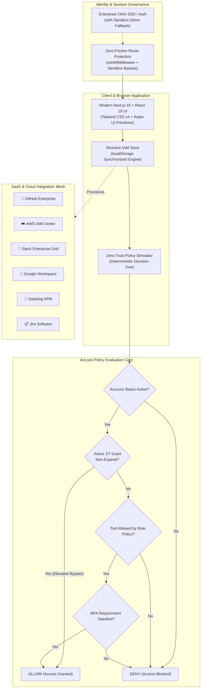

# AirLock — Enterprise Identity & Access Management (IAM) Platform

<div align="center">


<br />
<br />

[](https://nextjs.org/)
[](https://react.dev/)
[](https://www.typescriptlang.org/)
[](https://tailwindcss.com/)
[](https://www.radix-ui.com/)
[](LICENSE)
[](https://github.com/srinivasjangiti)

<p align="center">
  <strong>Control who gets in, what they access, and when.</strong><br>
  A modern, zero-trust Identity Governance & Access Management (IAM) suite with automated SaaS provisioning, real-time RBAC/ABAC policy simulation, Just-In-Time (JIT) ephemeral session grants, and immutable compliance audit trails.
</p>

[Explore Features](#-key-features) • [System Architecture](#-system-architecture) • [Getting Started](#-getting-started) • [IAM Policy Simulator](#-iam-policy-simulator) • [Creator Profile](#-creator--maintainer)

</div>

---

## 🌟 Executive Overview

Modern engineering organizations operate across dozens of disparate tools: GitHub organizations, AWS accounts, Slack workspaces, Google Workspace domains, and monitoring clusters. In traditional teams, provisioning and offboarding are manual, error-prone, and slow.

**AirLock** eliminates access sprawl by centralizing identity management, policy enforcement, and auditability into a single pane of glass:
- **Unified Identity Directory**: Manage employees, contractors, and service accounts with granular role delegation.
- **Multi-Tool SaaS Connectors**: One-click provisioning for GitHub, Slack, AWS IAM Identity Center, Google Workspace, Datadog, Jira, and Figma.
- **Zero-Trust Policy Engine & Simulator**: Test and verify complex permissions (`ALLOW` / `DENY`) across users, resources, and actions before deploying.
- **Just-In-Time (JIT) Ephemeral Grants**: Issue self-expiring, time-limited break-glass access (1h, 4h, 24h, 7d) to minimize attack surfaces.
- **Forensic Audit Activity Log**: Immutable event logs with real-time severity scoring and one-click RFC-compliant CSV export for SOC 2 and ISO 27001 readiness.
- **Frictionless Sandbox Mode**: Zero setup barriers—explore the full interactive dashboard immediately via persistent client-side state without external API dependencies.

---

## 🏛️ System Architecture



---

## 🚀 Key Features

### 1. 👥 Team Directory & CSV Bulk Onboarding
- Search, filter, and inspect team members by security role, department, MFA enrollment, and assigned SaaS tools.
- **Native CSV Parser**: Drag-and-drop or paste bulk CSV files (`Name,Email,Role,Department,Integrations`) to onboard dozens of team members simultaneously with live schema validation.
- One-click account suspension and instant offboarding revocation.

### 2. ⚡ Just-In-Time (JIT) Ephemeral Access
- Eliminate standing administrative privileges by issuing time-bounded access passes with automated expiration.
- Custom grant durations (1 hour, 4 hours, 8 hours, 24 hours, or 7 days).
- Real-time countdown tracking, manual emergency revocation, and automated compliance logging.

### 3. 🎯 Interactive IAM Policy Simulator
- An enterprise-grade evaluation sandbox to test permission policies before assigning them in production.
- Select any team member, target service, and action string (e.g. `aws:execute-production-migration`, `github:force-push`).
- Visual zero-trust verification stages showing account verification, JIT bypass check, RBAC tool whitelisting, and hardware MFA enforcement.

### 4. 🔌 SaaS & Cloud Connector Catalog
- Pre-configured connectors for **GitHub**, **Slack**, **AWS IAM Identity Center**, **Google Workspace**, **Datadog**, **Jira**, **Figma**, and **Notion**.
- Live directory sync triggers, member allocation metrics, and permission scope cards.

### 5. 📜 Immutable Forensic Audit Log
- Centralized event tracking for member invites, role transitions, connector status shifts, policy evaluations, and JIT sessions.
- Categorized severity tiers: `critical`, `warning`, `success`, and `info`.
- **RFC-Compliant CSV Export**: Instant one-click export of the entire audit trail with timestamps, actors, targets, and originating IP addresses.

### 6. 🛡️ Continuous SOC 2 Type II, ISO 27001, HIPAA & GDPR Auditor
- Automated compliance readiness scoring evaluated across active identities, MFA rates, and JIT sessions.
- Control matrix validation covering **CC6.1**, **CC6.2**, **CC6.3**, **CC6.6** (MFA), and **CC6.8** (Audit Logs).
- **1-Click Automated Remediations**: Enforce hardware/TOTP MFA organization-wide, purge expired JIT grants, and generate auditor attestation packages in JSON format.

### 7. 💻 Developer API & Webhooks Studio
- Programmatic IAM automation with scoped API keys (`iam:read`, `iam:write`, `access:evaluate`, `jit:create`).
- **Interactive API Sandbox**: Live endpoint testing with real simulated latency and dynamic SDK code generation for **cURL**, **TypeScript / Node.js**, **Python**, and **Go**.
- **Event Webhook Dispatcher**: Test downstream event streaming for `member.provisioned`, `jit.granted`, and `policy.violation`.

### 8. ⌨️ Global Command Palette (`⌘K` / `Ctrl+K`)
- Lightning-fast modal navigation across pages, member records, and connected tools.
- Instant action triggers: run policy simulations, issue break-glass passes, toggle themes, and reset demo data in seconds.

### 9. 📊 Visual Access Analytics & Anomaly Detection
- Interactive 7-day traffic chart tracking daily `ALLOW` vs `DENY` decision volume.
- Visual privilege distribution breakdown across engineering, design, and operations teams.
- Built-in AI anomaly monitor flagging off-hours access sessions and least-privilege violations.

### 10. 🎨 High-Aesthetic Design System
- Built with **Tailwind CSS v4** and modern **OKLCH** color tokens.
- Native Dark / Light / System theme switching powered by `next-themes`.
- Accessible component primitives built upon **Radix UI** with custom micro-animations.

---

## 🛠️ Tech Stack

| Layer | Technologies |
| :--- | :--- |
| **Framework** | [Next.js 16 (App Router)](https://nextjs.org/) & [React 19](https://react.dev/) |
| **Language** | [TypeScript 5](https://www.typescriptlang.org/) |
| **Database & ORM** | [Prisma ORM](https://www.prisma.io/) with SQLite (local) / PostgreSQL (production) |
| **Cryptography** | Node.js `crypto` (SHA-256 API key hashing, HMAC-SHA256 signed JIT tokens, Merkle audit chaining) |
| **Enterprise SSO & SCIM** | SCIM 2.0 (RFC 7643 & RFC 7644) for Okta, Microsoft Entra ID (Azure AD), and PingIdentity |
| **Cloud & SaaS SDKs** | AWS SDK v3 STS (`@aws-sdk/client-sts`), GitHub Octokit REST, Slack Web API |
| **Testing** | [Vitest](https://vitest.dev/) automated unit & integration test runner |
| **Styling** | [Tailwind CSS v4](https://tailwindcss.com/) with OKLCH Color Model & CSS Variables |
| **Components** | [Radix UI](https://www.radix-ui.com/) primitives (`@radix-ui/react-*`) |
| **Auth** | [Clerk Authentication](https://clerk.com/) with Zero-Dependency Sandbox Fallback |

---

## 🌐 Enterprise SCIM 2.0 & REST API

AirLock provides a production-grade API surface for automation and identity federation:

### SCIM 2.0 Protocol (RFC 7643 & RFC 7644)
- `GET /api/scim/v2/ServiceProviderConfig`: RFC 7643 discovery endpoint.
- `GET /api/scim/v2/Schemas`: RFC 7643 schema definitions for Users and Groups.
- `GET /api/scim/v2/Users`: Query and filter users (`filter=userName eq "..."`).
- `POST /api/scim/v2/Users`: Provision new employee or service account.
- `GET /api/scim/v2/Users/:id`: Inspect individual SCIM user profile.
- `PATCH /api/scim/v2/Users/:id`: Update user attributes or deprovision (`active: false`).
- `DELETE /api/scim/v2/Users/:id`: Remove identity from enterprise directory.

### Core IAM REST API
- `POST /api/v1/access/evaluate`: Deterministic zero-trust ABAC/RBAC authorization engine with MFA validation.
- `POST /api/v1/jit/grant`: Issue cryptographically signed HMAC-SHA256 ephemeral access tokens.
- `POST /api/v1/jit/verify`: Cryptographically verify signatures, claims, and active database status.
- `GET /api/v1/members` & `POST /api/v1/members`: Programmatic directory management with database persistence.
- `GET /api/v1/audit/logs`: Stream tamper-evident audit ledger entries.
- `GET /api/v1/audit/verify`: Mathematical proof and attestation of unbroken SHA-256 audit chain.
- `POST /api/cron/jit-revoke`: Automated worker endpoint to revoke expired JIT passes and update audit trails.

---

## 🏁 Getting Started

### Prerequisites
- Node.js 18.18+ or 20+ installed
- npm, yarn, or pnpm

### Installation

1. **Clone the repository:**
   ```bash
   git clone https://github.com/srinivasjangiti/airlock.git
   cd airlock
   ```

2. **Install dependencies:**
   ```bash
   npm install
   ```

3. **Initialize the database:**
   ```bash
   npx prisma db push
   ```

4. **Run the automated test suite:**
   ```bash
   npm test
   ```

5. **Start the local development server:**
   ```bash
   npm run dev
   ```

6. **Open your browser:**
   Navigate to [http://localhost:3000](http://localhost:3000) or [http://localhost:3000/dashboard](http://localhost:3000/dashboard) to explore the platform.

---

## 🧪 Automated Testing & Verification

AirLock includes an automated test suite verifying security invariants, cryptographic primitives, and protocol compliance:

```bash
# Run Vitest test suites
npm test

# Run Next.js production build
npm run build
```

---

## 👨‍💻 Creator & Maintainer

<div align="center">

### **Srinivas Jangiti**
*Software Engineer & Systems Architect*

[](https://github.com/srinivasjangiti)
[](https://www.linkedin.com/in/srinivasajan/)
[](https://x.com/sriwanders)
[](https://substack.com/@sriwanders)
[](https://medium.com/@sriwanders)
[](https://www.youtube.com/@srinivasjan)
[](https://leetcode.com/u/srinivasaj/)

<br />

📬 **Email**: [srinivasajan.work@gmail.com](mailto:srinivasajan.work@gmail.com)  
📱 **Mobile**: [+91 8767505121](tel:+918767505121)

</div>

---

## 📄 License

This project is licensed under the **MIT License** — see the [LICENSE](LICENSE) file for details.

```
Copyright (c) 2026 Srinivas Jangiti
```
